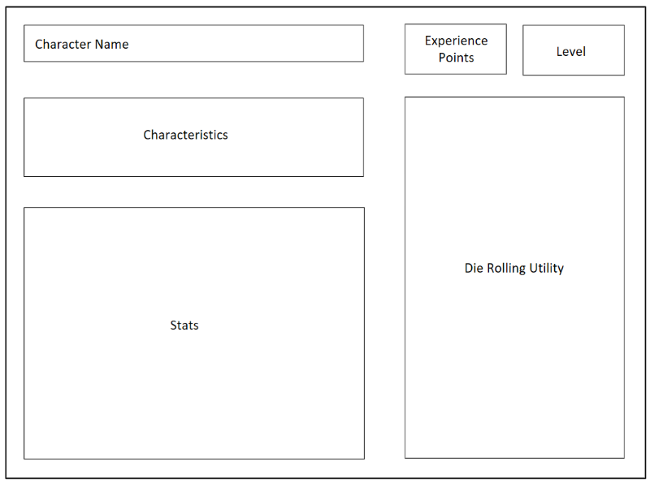

# Design Document - v0.1

The smallest version of the project.

## Characteristics

Static page. No server-side processing. One user.
One character sheet. One die. Simplified character sheet.

## Goals

Get a minimum skeleton running, focused on developing the
HTML/CSS template.

## Components

* Simplified Character Sheet
    * Name
    * Level
    * Experience Points
    * Characteristics
        * Race
        * Class
        * Background
        * Alignment
    * Stats
        * Strength
        * Dexterity
        * Constitution
        * Intelligence
        * Wisdom
        * Charisma
* Die Roller

## Static Page Schematic

