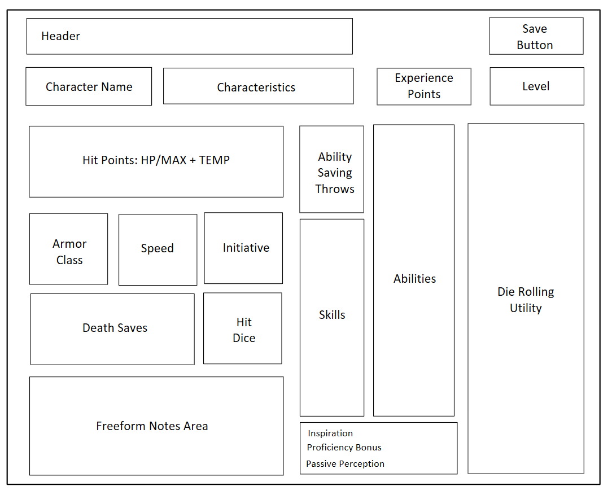

# Design Document - v0.2

Upgrading v0.1 in three ways.

1. Add aesthetic CSS
2. Expand character sheet
3. Add persistence

## Detailed Additions

1. Add aesthetic CSS
     * Choose a color palette
     * Choose fonts
     * Standardize the module look
2. Expand character sheet
     * Ability saving throws
     * Skills
     * Inspiration
     * Proficiency bonus
     * Passive perception
     * Hit points + Max HP + Temp HP
     * Hit Dice
     * Death saves
     * Armor Class
     * Speed
     * Initiative
     * d20, d12, d10(0), d10, d8, d6, d4
     * Free Notes Section
3. Add persistence
     * Build a JS Character Sheet class, grouping multiple Module classes.
     * Save button
     * Site load behavior : Notifies if save file exists; asks to load. If not, show blank sheet.
     * Site save behavior : Always warns of overwrite and asks for confirmation.
     * No accounts or authentication. 1 sheet with 1 version. No backups.

## Page Schematic

